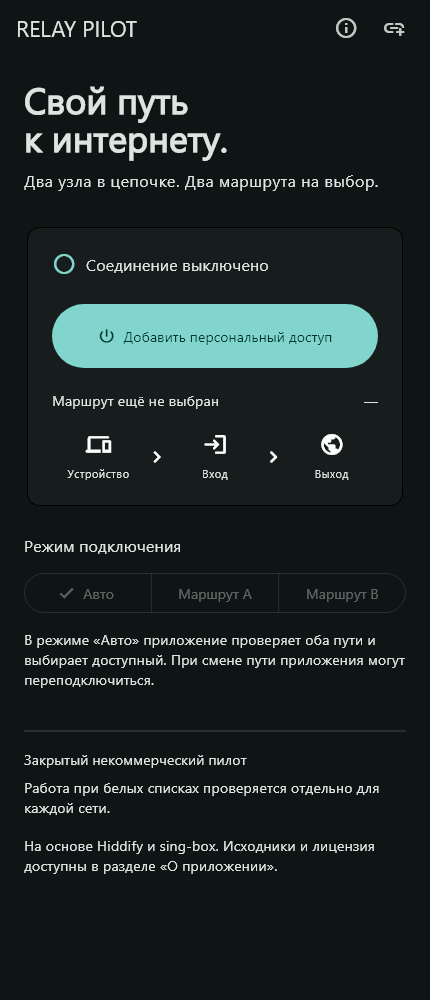

# Relay Pilot

Локальная реализация закрытого некоммерческого пилота для Android и Windows, до 10 участников. Основана на **Hiddify App v4.1.1**. Это исходный код и проверенный локальный стенд, **пока не готовый к подключению пользователей сервис**: серверы не арендованы, APK и установщик не выпущены, проверки на устройствах не завершены.

## Подключение

| Режим | Полная цепочка |
|---|---|
| Маршрут A | Устройство → VLESS + Reality на входе A → VLESS + TLS на общем выходе → интернет |
| Маршрут B | Устройство → Hysteria2 на входе B → VLESS + TLS на том же выходе → интернет |
| Авто | Проверка обеих полных цепочек раз в 15 секунд, выбор работающей |

Внутри VLESS + TLS включён smux: короткие TCP-потоки закрываются независимо от внешнего транспорта Hysteria2.

Каждый выход клиента соединяется с общим выходным сервером через `detour` своего входа. DNS пользовательских сайтов идёт через общий выход. Входы разрешают только адрес и порт выхода; прямого резервного outbound в клиенте нет. При переключении приложения могут переподключаться. Общий выход остаётся единой точкой отказа. Отключение VPN самим пользователем возвращает обычное соединение ОС; отдельный системный kill switch в этой версии не реализован.

## Что изменено относительно Hiddify

- Собственные название, значок, русское оформление, главный экран и идентификаторы Android/Windows. Три режима, состояние, активный маршрут и задержка; добавление доступа ссылкой, QR камерой на Android или изображением QR на обеих платформах.
- Полные JSON-профили сервиса сохраняются без преобразования Hiddify. Проверка закрытой схемы перед импортом и запуском, raw-режим ядра, атомарное обновление с сохранением предыдущего корректного профиля. Обновление при запуске и раз в сутки.
- Для локального управления ядром включён mTLS, собственные порты 17178/17179, сертификат сервера проверяется через доверенный нативный интерфейс. Android хранит рабочие файлы во внутреннем каталоге приложения; исключения других приложений из VPN отключены.
- Убраны предложения магазина, запросы отзыва и внешние автоматические обновления. Телеметрия отключена. Обновление приложения открывается со страницы проекта; установленные сборки обновляются вручную.
- Go + SQLite: персональные секретные ссылки `/sub/{token}`, CLI для выдачи/срока/перевыпуска/отзыва, максимум 10 активных участников, отзыв всех транспортных ключей на трёх узлах, резервное копирование согласованной базы.
- Проверяемое применение конфигурации по SSH с закреплёнными host keys. Последовательные поколения не дают вернуть старые ключи запоздалым запросом. Каждый узел требует продления разрешения каждые 60 секунд и останавливается при потере управления. Подготовлены Caddy, systemd, проверка сертификатов и резервные копии.
- Новые проверки и GitHub Actions; версии и контрольные суммы закреплены. Старые workflow сохранены только как справочные файлы.

## Начать работу

1. Откройте [результаты проверок и незавершённые проверки](docs/QA.md).
2. [Сборка, версии и QR](docs/BUILD.md): локальные команды и подготовленный Actions workflow.
3. [Развёртывание и эксплуатация](docs/DEPLOY.md): три свежих VPS, DNS, TLS, SSH, выдача доступа, backup и откат.
4. [Предварительная смета](docs/BUDGET.md): **2 429 ₽/месяц**, домен и внешнее хранение резервных копий отдельно; цены требуют подтверждения в заказе.

Код приложения — `lib/features/relay/`, сервис — `service/`, установка — `ops/`, установщик — `windows/relay-pilot.iss`. `ops/inventory.example.json` содержит заглушки: до заполнения реальными адресами и ключами сервис не подключается. Лабораторные ключи и адреса из тестов не предназначены для выдачи доступа.

Репозиторий проекта: https://github.com/InnoKesha1/relay-pilot, ветка `pilot` на основе Hiddify v4.1.1. Публикация исходников не означает готовность сервиса к использованию. Перед распространением сборок нужно выполнить релизную сборку через GitHub Actions и пройти приёмку в соответствии с сохранёнными условиями Hiddify.

Сначала подключается владелец после проверок на устройствах и реальных VPS; расширение до 10 участников — после успешного приёмочного прогона. Для белых списков отдельно проверяется доступность собственных входов в конкретной сети. https://online-edu.mirea.ru/my/ — только контрольный ресурс; его доступность не доказывает работу VPN.

## Авторство и условия

Исходное приложение разработано [Hiddify](https://github.com/hiddify/hiddify-app), закреплённый тег [v4.1.1](https://github.com/hiddify/hiddify-app/tree/v4.1.1), commit `abbd671bf6bf05195acd4158c714bff267cada8f`. Авторские уведомления и [LICENSE.md](LICENSE.md) сохранены. Изменения Relay Pilot описаны выше; они распространяются на тех же условиях. В исходной лицензии есть дополнительные требования к некоммерческому использованию, публикации форка, авторству и выпуску через Actions. Отдельные сторонние библиотеки сохраняют собственные лицензии.

Используются [Hiddify Core](https://github.com/hiddify/hiddify-core), [sing-box](https://github.com/SagerNet/sing-box), [Caddy](https://github.com/caddyserver/caddy), Flutter, Go, SQLite и зависимости, перечисленные в lock-файлах. Встроенное ядро: Hiddify Core 4.1.0; серверный sing-box: 1.13.0. Приложение содержит страницу авторства и полный текст лицензии.
